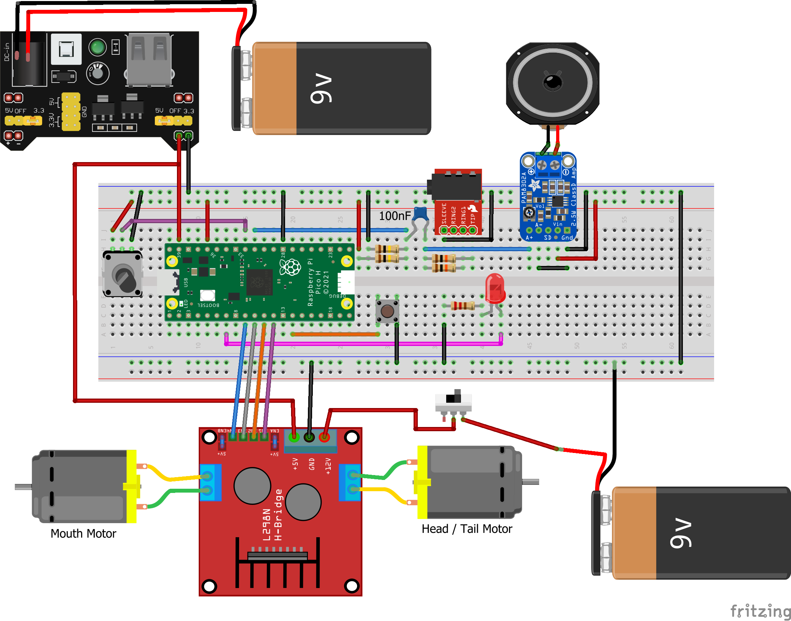

# Big Mouth Billy Bass Reactive Speaker
This project is my final project for MEGN200 (Programming and Hardware Interface). It is a Big Mouth Billy Bass toy that has been modified to accept a 3.5mm audio input. This input is interpereted by a Raspberry Pi Pico to make the fish move based on the audio. 

## Operation
The red button on the Billy Bass is used as a mode selector that tells the fish if it should be in music mode or speech mode. The fish will respond differently to audio depending on which mode it is in. The differences are subtle, but in the future I would like to implement more features for each mode. The potentiometer is used to fine tune the sensitivity to audio levels.

## Components
- Big Mouth Billy Bass
- Raspberry Pi Pico
- L298N Motor Driver
- Breadboard Power Module
- Adafruit Mono Amplifier (PAM8302)
- Panel Mount 3.5mm Jack
- Panel Mount Potentiometer
- 2x 100kΩ Resistors
- 2x 10kΩ Resistors
- 1x 220Ω Resistor
- 1x 100nF Capacitor
- 1x LED
- 2x 9v Batteries

## Circuit

The Line-in portion of this circuit is from [this project](https://github.com/s-marley/ESP32_FFT_VU/blob/master/README.md#line-in).

The power supply used here is two 9v batteries. I have found that this setup is not ideal as the batteries do not last very long and the motors are not as strong as I would like them to be. The button, motors, slide switch, and speaker in the diagram are all components from the original Billy Bass.

## Limitations
The audio is processed based on its volume. This means that the fish cannot tell the difference between vocals and instruments. The power supply is also a limitation. With the my batteries, the head motor and mouth motor could not be operated at the same time. In the future I would like to implement a better power system so that I can utilize the head and tail motion instead of only the mouth. I used the two motor model of the Billy Bass which means that it is impossible to move both the head and the tail at the same time.
